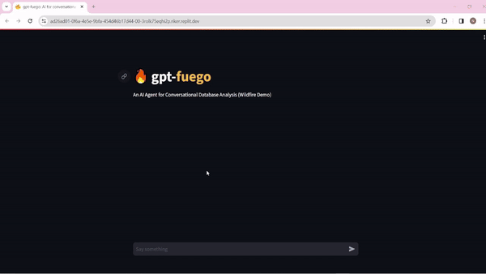

## About GPT-fuego

`GPT-fuego` is a cutting-edge agent designed to enhance the capabilities of Large Language Models (LLMs) through a unifying interface that integrates various generative operations. It combines speacialized fine-tuning with zero-shot calls to let users chat with SQL databases and external data APIs simultaneously. Built with Streamlit, Replit, and OpenAI.

## Features

- **Enhanced Generative Operations**: GPT-fuego brings together a wide range of generative techniques to foster innovation in the field.
- **User-friendly Interface**: Designed with the end-user in mind, the framework offers an intuitive interface for seamless integration into existing projects.
- **Scalability**: Built to scale, GPT-fuego supports projects ranging from small-scale experiments to large, complex applications.
- **Open Source**: GPT-fuego is open source, encouraging contributions and modifications from the global developer community.
